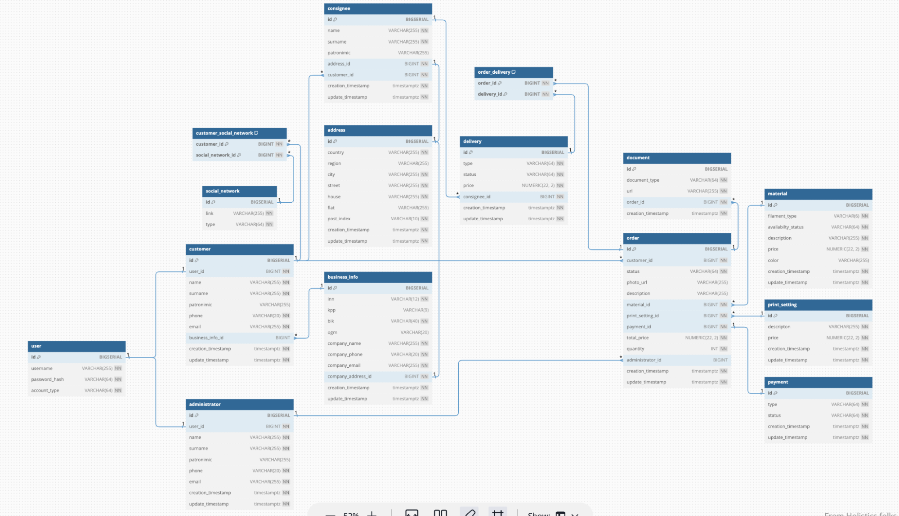

# Рефакторинг приложения

## Описание существующего приложения

### Общая информация

- [Техническое задание](docs/pdf/term-paper-requirements.pdf)
- Команда
    - Поветин Илья (336189)
    - Пегушина Екатерина Александровна (338862)
- Группа
    - P34121

### Предметная область

Система для управления студией 3D-печати

#### Подробное описание предметной области

Цель приложения: упростить заказ услуг 3D-печати для конечного пользователя, сделать процесс более “прозрачным”.

Услугами 3D-печати пользуются не только физические лица, но и юридические. Приложение должно предоставлять функционал и для них.

Чтобы совершить заказ, у пользователя должен быть аккаунт.
- Аккаунт физического лица:
  - Имя
  - Фамилия
  - Отчество (при наличии)
  - Электронная почта
  - Номер телефона
  - Ссылка на аккаунт какой-либо социальной сети (для связи, опционально)
  - Адрес доставки
- Аккаунт юридического лица:
  - Имя
  - Фамилия
  - Отчество (при наличии)
  - Название компании
  - ИНН
  - КПП
  - Электронная почта
  - Номер телефона
  - Ссылка на аккаунт какой-либо социальной сети (для связи, опционально)
  - Адрес доставки

При заказе услуги 3D-печати, у пользователя есть выбор таких факторов, как:
- Фото/чертеж/файл необходимой модели Пользователь предоставляет сам (этого может и не быть)
- Описание модели (что нужно, где используется, какая среда, температура) Пользователь предоставляет сам (этого может и не быть)
- Тираж (при оптовом заказе (>10 деталей) предоставляется скидка 5%)
- Материал для изготовления модели Выбирается из списка, предоставленного 3D-студией (администратором)
  - Наличие материала
    - Материал в наличии
    - Материал недоступен (закончился)
    - Материал доступен по спец-заказу
  - Описание материала (характеристики)
  - Цена материала за грамм
- Цвет модели Выбирается из списка, предоставленного 3D-студией (администратором), зависит от выбранного материала 
- Настройки печати
  - Ориентация на скорость
  - Ориентация на внешний вид
  - Ориентация на прочность
- Способ оплаты
  - По счету (для юридических лиц)
  - По карте (для всех)
- Выбор способа получения
  - Доставка
  - Самовывоз
- После выбора всех параметров, пользователю предоставляются сроки изготовления, примерная стоимость и сроки доставки

После оформления заказа, администратор его рассматривает, связывается с пользователем для подтверждения заказа, при необходимости уточняет характеристики, сообщает итоговую стоимость (материал + печать + разработка модели) и берет заказ в работу/отменяет его при отказе пользователя.

У пользователя есть страница всех его заказов, где он может увидеть статус заказа, оплатить заказ, скачать документы, повторить заказ.

После выполнения заказа, у пользователя появляется возможность оплатить его (картой/счетом) и получить документы по заказу (для юридических лиц).

Также, в приложении есть отдельная страница, на которой пользователь может увидеть подробное описание материалов (имеющихся у студии), подробно почитать про возможные настройки печати, узнать из чего складывается стоимость заказа. Все это может заполняться и редактироваться администратором.

Со стороны администратора:
- Список созданных заказов и личные кабинеты заказчиков
- Возможность перемещать заказы по статусам. У заказа будет система статусов (создан, в работе, выполнен и т.п.)
- Возможность изменять информацию (о наличии материалов, описании характеристик и т.п.)
- Возможность прикреплять документы к заказу
- Возможность указать стоимость заказа и прикрепить ссылку на оплату/счет
- Возможность изменять какие-то параметры заказа (материал,настройки), после разговора с пользователем, оформившим заказ

Сценарии использования системы:

Сценарий 1
Оформление первого заказа

1. Пользователь заходит, регистрируется
2. Авторизуется
3. Читает информацию о материалах, настройках печати и ценообразовании
4. Оформляет заказ (заполняет поля, прикрепляет фото и т.п.)
5. Администратор видит заказ, связывается с пользователем
6. Администратор выставляет цену
7. Пользователь подтверждает заказ
8. Администратор берет заказ в работу
9. Заказ выполняется, пользователь администратор прикрепляет ссылку на оплату/счет
10. Пользователь оплачивает заказ, администратор его отправляет
11. Администратор прикрепляет закрывающий документы (при необходимости)

Сценарий 2
Повтор уже существующего заказа
1. Пользователь авторизуется
2. Переходит во вкладку “Мои заказы” 
3. Выбирает заказ, нажимает “Повторить” 
4. Далее флоу аналогичный “Оформлению первого заказа” с п.5

### Даталогическая модель

### Backend

Spring boot application stack:

- spring boot web
- spring boot jooq
- postgresql

## Предложения по рефакторингу

### Этап 1

- [ ] Декомпозиция кода
- [ ] Реструктуризация репозитория
- [ ] Корректная генерация jOOQ классов
- [ ] Генерация слоя взаимодействия (controller, client) с использованием OpenApi спецификации
- [ ] Добавление корректного логгирования (sl4j)

### Этап 2

- [ ] Добавить поддержку Spring Security, ибо сейчас нет все на коленке
- [ ] Добавить поддержку liquibase для миграции

### Этап 3

Общее

- [ ] Написание unit-тестов
- [ ] Добавить развертывание backend, и database в контейнерах
- [ ] Настроить CI/CD